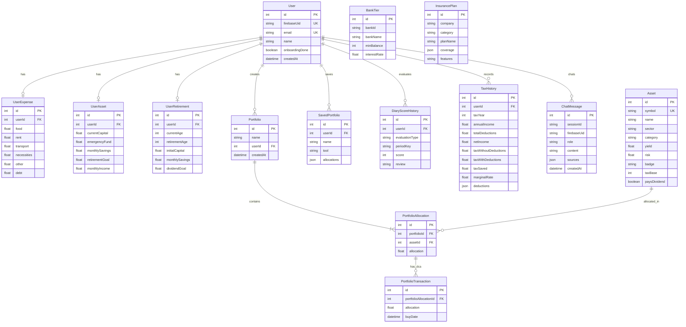

# FinShield System Architecture & File Summary
> **เอกสารสรุปโครงสร้างไฟล์และการออกแบบระบบ (System Design Summary)**  
> จัดทำขึ้นเพื่อใช้เป็นข้อมูลอ้างอิงในการจัดทำ **รายงานโครงงานบทที่ 4: การออกแบบระบบ (System Design)**  
> *สถานะระบบ: ฟีเจอร์ล่าสุดครบวงจร (Full Features & Architecture Integration)*

---

## 1. ภาพรวมสถาปัตยกรรมระบบ (System Architecture Overview)

FinShield ถูกออกแบบตามสถาปัตยกรรมแบบ **Modern Client-Server & Micro-service Oriented Integration**:
- **Frontend (Web Application)**: พัฒนาด้วย Next.js 14 (App Router), React, TypeScript และ Tailwind CSS รองรับ Responsive Web และ Dark/Light Mode
- **Backend (API & Computation Engine)**: พัฒนาด้วย Node.js, Express.js และ TypeScript ทำหน้าที่เป็นศูนย์กลางคำนวณทางการเงิน จัดการ Business Logic และ Proxy เชื่อมต่อ AI
- **Database & ORM**: ฐานข้อมูลเชิงสัมพันธ์ PostgreSQL (ผ่าน Supabase) บริหารจัดการโครงสร้างผ่าน Prisma ORM พร้อมระบบ Auto-seeding
- **Authentication**: ระบบยืนยันตัวตนด้วย Firebase Authentication (Email/Password & Google OAuth) และเชื่อมต่อ Backend ด้วย JWT Token Verification
- **AI & RAG Pipeline**: ใช้ OpenAI API (`gpt-4o-mini`) ผสานกับ **Tavily Search API** ทำหน้าที่สืบค้นข้อมูลตลาดการเงินแบบ Real-time (Retrieval-Augmented Generation)
- **Financial Market Data**: เชื่อมต่อ Yahoo Finance API สำหรับดึงราคาหลักทรัพย์แบบ Real-time, ปฏิทินเงินปันผล, คำนวณ P&L และเชื่อมต่อ TradingView API สำหรับอัตราเงินเฟ้อไทย (YoY)

---

## 2. แผนผังโครงสร้างไฟล์ของระบบ (Project File Tree)

### 2.1 โครงสร้างฝั่งเซิร์ฟเวอร์ (Backend)
```text
Backend/
├── prisma/
│   ├── schema.prisma                          ✨ โครงสร้างฐานข้อมูลเชิงสัมพันธ์แบบ Normalized (11 Models)
│   └── seed.ts                                🌱 Script หลักสำหรับ Seed ข้อมูลตั้งต้น
├── src/
│   ├── index.ts                               🚀 จุดเริ่มต้น Express Server, CORS, Route Mounting & Auto-seed
│   ├── controllers/                           🎮 ตัวควบคุมตรรกะการประมวลผลคำขอ (Request Controllers)
│   │   ├── finance.controller.ts              - จัดการข้อมูลสถานะการเงินผู้ใช้ (Income, Expense, Asset, Debt)
│   │   ├── insurance.controller.ts            - ค้นหาและดึงข้อมูลแผนประกันภัย
│   │   └── taxHistory.controller.ts           - บันทึกและดึงประวัติการคำนวณภาษีรายปี
│   ├── routes/                                🛣️ จุดกำหนด API Endpoints
│   │   ├── simulator.routes.ts                - Endpoints จำลองการเงิน, ตลาดทุน, สินทรัพย์ และพอร์ต
│   │   ├── finance.routes.ts                  - Endpoints จัดการข้อมูลสุขภาพการเงินของผู้ใช้
│   │   ├── ai.routes.ts                       - Endpoints แนะนำพอร์ต, RAG Chatbot, และประวัติการแชท
│   │   ├── insurance.routes.ts                - Endpoints ดึงแผนประกันภัย
│   │   └── taxHistory.routes.ts               - Endpoints บันทึก/ลบ/เรียกดูประวัติภาษี
│   ├── services/                              ⚙️ ตรรกะการคำนวณและบริการภายนอก (Business & Calculation Services)
│   │   ├── simulationService.ts               - อัลกอริทึมคำนวณเงินเฟ้อ, เงินสำรองฉุกเฉิน, ดอกเบี้ยทบต้น, Stress Test
│   │   ├── databaseService.ts                 - การบันทึกและจัดการพอร์ต/คะแนนไดอารี่ในฐานข้อมูล
│   │   ├── dividendService.ts                 - ดึงข้อมูลและคำนวณปฏิทินเงินปันผลจาก Yahoo Finance
│   │   ├── marketDataService.ts               - ดึงราคาหลักทรัพย์และอัตราแลกเปลี่ยน USD/THB แบบเรียลไทม์
│   │   ├── profitLossService.ts               - คำนวณกำไร-ขาดทุนพอร์ต (P&L) และจำลองการซื้อแบบ DCA
│   │   ├── yahooSearchService.ts              - ระบบค้นหาและดึงข้อมูลสินทรัพย์แบบ Dynamic Caching
│   │   └── tavily.service.ts                  - ระบบค้นหาข้อมูลเว็บแบบเรียลไทม์สำหรับ RAG Architecture
│   ├── middlewares/                           🛡️ มิดเดิลแวร์ตรวจสอบสิทธิ์และความถูกต้อง
│   │   ├── auth.middleware.ts                 - ตรวจสอบความถูกต้องของ Firebase ID Token
│   │   └── error.middleware.ts                - ดักจับและจัดการ Error ส่วนกลาง
│   └── utils/                                 📦 ยูทิลิตี้และข้อมูลตั้งต้น
│       ├── seedAssets.ts                      - ตรวจสอบและ Auto-seed สินทรัพย์ 100+ รายการ
│       ├── seedBankTiers.ts                   - ตรวจสอบและ Auto-seed ขั้นบันไดดอกเบี้ยธนาคารพาณิชย์ 11 สถาบัน
│       └── assetSeedData.ts                   - ฐานข้อมูลสินทรัพย์ตั้งต้น (หุ้นไทย, หุ้นสหรัฐ, REITs, ETF)
```

### 2.2 โครงสร้างฝั่งผู้ใช้งาน (Frontend)
```text
Frontend/
├── src/
│   ├── app/                                   📱 Next.js 14 App Router (Pages & Layouts)
│   │   ├── layout.tsx                         - Root Layout, Theme Provider, Uicons CDN & Metadata
│   │   ├── page.tsx                           - หน้าแรก (Landing Page)
│   │   ├── login/page.tsx                     - หน้าระบบเข้าสู่ระบบ (Authentication)
│   │   ├── signup/page.tsx                    - หน้าระบบลงทะเบียนผู้ใช้ใหม่
│   │   ├── reset-password/page.tsx            - หน้ารีเซ็ตรหัสผ่าน
│   │   └── simulator/                         - โครงสร้างหน้าจำลองสถานการณ์การเงิน
│   │       ├── layout.tsx                     - Top Bar Navigation, Theme Toggle, Auth Guard & Chatbot
│   │       ├── layout.css                     - สไตล์การจัดวาง Top Navigation และโครงสร้าง Layout
│   │       ├── page.tsx                       - Redirect Router -> `/simulator/overview`
│   │       ├── overview/page.tsx              - หน้าแดชบอร์ดภาพรวมสุขภาพการเงิน (Financial Overview)
│   │       ├── wealth-plan/page.tsx           - หน้ารวมเป้าหมายการเงินและการจัดสรรความมั่งคั่ง (Wealth Plan)
│   │       ├── wealth-plan-suggest/page.tsx   - หน้า AI แนะนำสัดส่วนพอร์ตการลงทุนแบบบูรณาการ
│   │       ├── tax/page.tsx                   - หน้าคำนวณ วางแผน และลดหย่อนภาษี (Tax Optimizer)
│   │       ├── diary/page.tsx                 - หน้าบันทึกไดอารี่การเงินและประเมินพฤติกรรม (Retirement Diary)
│   │       └── retirement/page.tsx            - Redirect Router -> `/simulator/wealth-plan`
│   ├── components/
│   │   ├── simulator/                         🧩 คอมโพเนนต์การทำงานหลัก (Modular Tool Components)
│   │   │   ├── OverviewTool.tsx               - แดชบอร์ดแสดง Net Worth, รายรับ-รายจ่าย, สถานะเป้าหมาย และสุขภาพการเงิน
│   │   │   ├── WealthPlanTool.tsx             - เครื่องมือวางแผนการเงินบูรณาการ (ฉุกเฉิน, เงินเฟ้อ, DCA, วิกฤต)
│   │   │   ├── PortfolioBuilder.tsx           - เครื่องมือจัดพอร์ตการลงทุน เลือกสินทรัพย์ คำนวณความเสี่ยงและผลตอบแทน
│   │   │   ├── TaxOptimizer.tsx               - เครื่องมือคำนวณภาษีเงินได้บุคคลธรรมดา, สิทธิลดหย่อน และบันทึกประวัติภาษี
│   │   │   ├── RetirementDiary.tsx            - สมุดบันทึกการเงิน พร้อมระบบ AI ให้คำแนะนำและตัดเกรดพฤติกรรม
│   │   │   ├── AiAdvisor.tsx                  - คอมโพเนนต์เรียก AI แนะนำสัดส่วนพอร์ตพร้อมแจกแจงเหตุผลเชิงลึก
│   │   │   ├── ChatAssistant.tsx              - แชทบอทอัจฉริยะลอยตัว (Floating Chatbot) พร้อมระบบค้นหาข้อมูล RAG
│   │   │   ├── SettingsPanel.tsx              - แผงตั้งค่าข้อมูลส่วนบุคคล, ปรับธีม และแก้ไขข้อมูลการเงินตั้งต้น
│   │   │   ├── InfoTooltip.tsx                - คอมโพเนนต์ Tooltip ให้ข้อมูลนิยามทางการเงิน
│   │   │   ├── PageSkeleton.tsx               - คอมโพเนนต์แสดงผลระหว่างรอโหลดข้อมูล (Skeleton Loading)
│   │   │   └── wealth-plan/                   - ซับคอมโพเนนต์เฉพาะสำหรับโมดูล Wealth Plan
│   │   │       ├── DashboardView.tsx          - หน้าแสดงกราฟเปรียบเทียบพอร์ต, Cashflow Chart และสรุปผล
│   │   │       ├── WealthPlanForm.tsx         - ฟอร์มกรอกตัวเลขและตั้งค่าเป้าหมายการเงิน
│   │   │       ├── PortfolioModal.tsx         - ป็อปอัปสำหรับเปิดหน้าจัดพอร์ตการลงทุนแบบละเอียด
│   │   │       ├── useWealthPlanState.ts      - Custom React Hook จัดการ State การจำลองและการคำนวณทั้งหมด
│   │   │       └── wealthPlanTypes.ts         - ประกาศ Type Definition สำหรับโมดูล Wealth Plan
│   │   └── ui/                                🎨 สไตล์ชีทเฉพาะแต่ละโมดูล
│   │       ├── OverviewTool.css
│   │       ├── WealthPlanTool.css
│   │       ├── PortfolioBuilder.css
│   │       ├── RetirementDiary.css
│   │       ├── AiAdvisor.css
│   │       ├── ChatAssistant.css
│   │       └── SettingsPanel.css
│   ├── contexts/                              🌐 การจัดการสถานะส่วนกลาง (Global State Management)
│   │   ├── AuthContext.tsx                    - จัดการสถานะผู้ใช้, การเข้าสู่ระบบ และ Firebase Session
│   │   └── FinanceContext.tsx                 - ซิงค์ข้อมูลการเงินของผู้ใช้ (รายได้, รายจ่าย, สินทรัพย์, หนี้สิน) กับฐานข้อมูล
│   └── lib/                                   🔧 ไลบรารีผู้ช่วยฝั่ง Frontend
│       ├── api.ts                             - Wrapper ฟังก์ชันเรียก REST API พร้อมแนบ Bearer Token
│       ├── financeService.ts                  - ฟังก์ชันจัดการข้อมูลการเงินของผู้ใช้
│       ├── firebase.ts                        - การกำหนดค่า Firebase Client SDK
│       └── taxCalculator.ts                   - โมดูลคำนวณภาษีตามขั้นบันไดอัตราภาษีของไทย
```

---

## 3. การออกแบบฐานข้อมูล (Database Schema Design)

ฐานข้อมูลได้รับการออกแบบให้อยู่ในรูปแบบ **Relational Database Schema (3NF Normalized)** ผ่าน Prisma ORM:



---

## 4. รายละเอียดฟังก์ชันและโมดูลการทำงานหลัก (System Functional Modules)

### 4.1 โมดูลแดชบอร์ดภาพรวมสุขภาพการเงิน (Financial Overview Dashboard)
- **ไฟล์หลัก**: `Frontend/src/components/simulator/OverviewTool.tsx`
- **หน้าที่**: รวบรวมข้อมูลสถานะทางการเงินของผู้ใช้มาประมวลผลเป็นดัชนีชี้วัดสุขภาพการเงิน (Financial Health Score)
- **ความสามารถ**:
  - วิเคราะห์ความมั่งคั่งสุทธิ (Net Worth Calculation)
  - วิเคราะห์กระแสเงินสดสุทธิ (Monthly Net Cashflow)
  - ติดตามความคืบหน้าของเป้าหมายสำคัญ (เงินสำรองฉุกเฉิน, เป้าหมายพอร์ตลงทุน, เงินเก็บเกษียณ)
  - แสดงสัญญาณเตือนความเสี่ยง (Financial Alert Indicators) เช่น ภาระหนี้เกิน 40% ของรายได้

### 4.2 โมดูลรวมแผนการเงินและการจัดสรรความมั่งคั่ง (Wealth Plan & Integrated Simulator)
- **ไฟล์หลัก**: `Frontend/src/components/simulator/WealthPlanTool.tsx`, `wealth-plan/`
- **หน้าที่**: รวมการวางแผนเงินสำรองฉุกเฉิน การลงทุนชนะเงินเฟ้อ และการจำลองสถานการณ์วิกฤตไว้ในหน้าเดียว
- **ความสามารถ**:
  - คำนวณเงินสำรองฉุกเฉินที่เหมาะสมตามระดับความเสี่ยงในอาชีพ
  - คำนวณผลกระทบของเงินเฟ้อตามอัตราจริงแบบทบต้น (Compound Inflation Impact)
  - รองรับการจำลองวิกฤต (Crisis Stress Test: ตกงาน, เจ็บป่วย, อุบัติเหตุ)
  - จำลองกลยุทธ์การลงทุน DCA (Dollar-Cost Averaging) รายเดือน
  - เชื่อมโยงผลลัพธ์เข้าสู่ AI Portfolio Generator เพื่อรับคำแนะนำพอร์ตที่เหมาะสม

### 4.3 โมดูลจัดพอร์ตการลงทุน (Portfolio Builder & Analytics Engine)
- **ไฟล์หลัก**: `Frontend/src/components/simulator/PortfolioBuilder.tsx`, `simulationService.ts`
- **หน้าที่**: ให้ผู้ใช้สามารถออกแบบ ปรับสัดส่วน และวิเคราะห์ประสิทธิภาพของพอร์ตลงทุน
- **ความสามารถ**:
  - คลังสินทรัพย์มากกว่า 100 รายการ แบ่ง 5 หมวด (หุ้นไทย, US Tech/Growth, DRx, REITs/IFF, ตราสารหนี้/ETF)
  - คำนวณผลตอบแทนที่คาดหวัง (Expected Yield) และระดับความเสี่ยงเฉลี่ยถ่วงน้ำหนัก (Weighted Risk)
  - แสดงปฏิทินเงินปันผลรายเดือนตลอดทั้งปี (Monthly Dividend Calendar) อิงข้อมูลจริงจาก Yahoo Finance
  - คำนวณผลกำไร-ขาดทุนย้อนหลัง (Backtesting P&L) ตามประวัติการเข้าซื้อ DCA
  - ตรวจสอบความถูกต้องของสัดส่วนการจัดสรรให้ครบ 100% เสมอ

### 4.4 โมดูลคำนวณและวางแผนภาษี (Tax Optimizer & Tax History)
- **ไฟล์หลัก**: `Frontend/src/components/simulator/TaxOptimizer.tsx`, `taxCalculator.ts`, `taxHistory.controller.ts`
- **หน้าที่**: คำนวณภาษีเงินได้บุคคลธรรมดา (ภ.ง.ด. 90/91) และวางแผนลดหย่อนภาษีอย่างมีประสิทธิภาพ
- **ความสามารถ**:
  - คำนวณภาษีตามขั้นบันไดอัตราภาษี 5% - 35% ของกรมสรรพากร
  - ครอบคลุมการลดหย่อนภาษีครบ 4 กลุ่ม (ส่วนตัว/ครอบครัว, ประกัน/การลงทุน เช่น SSF/RMF/ThaiESG, อสังหาฯ และเงินบริจาค)
  - วิเคราะห์จุดคุ้มทุนของเครดิตภาษีเงินปันผล (Dividend Tax Credit มาตรา 47 ทวิ) เปรียบเทียบกับ Final Tax 10%
  - บันทึกประวัติการยื่นภาษีรายปีลงฐานข้อมูล เพื่อเปรียบเทียบภาษีที่ประหยัดได้ในแต่ละปี
  - ให้คำแนะนำการเพิ่มยอดลดหย่อนภาษีด้วย AI Strategy Advisor

### 4.5 โมดูลบันทึกไดอารี่เกษียณและการประเมินพฤติกรรม (Retirement Diary & Behavior Evaluation)
- **ไฟล์หลัก**: `Frontend/src/components/simulator/RetirementDiary.tsx`
- **หน้าที่**: พื้นที่บันทึกพฤติกรรมการใช้จ่ายและบันทึกเป้าหมายการเงินของผู้ใช้
- **ความสามารถ**:
  - บันทึกข้อความการเงินแยกตามวัน/เดือน พร้อมตัวชี้วัดอารมณ์การเงิน (Mood & Sentiment)
  - ระบบ AI Financial Cheer ให้ข้อคิดและกำลังใจเชิงบวกในการปลดหนี้และออมเงิน
  - ระบบ AI Behavior Scoring ให้คะแนนวินัยทางการเงิน (0 - 100 คะแนน) และบันทึกลงฐานข้อมูลเพื่อดูแนวโน้มพัฒนาการ

### 4.6 ระบบผู้ช่วยการเงิน AI อัจฉริยะ (AI Assistant with RAG Pipeline)
- **ไฟล์หลัก**: `Frontend/src/components/simulator/ChatAssistant.tsx`, `Backend/src/routes/ai.routes.ts`, `tavily.service.ts`
- **หน้าที่**: ผู้ช่วยส่วนตัวทางการเงินแบบสนทนา (Conversational Agent)
- **ความสามารถ**:
  - สถาปัตยกรรม **Query Classifier**: วิเคราะห์คำถามผู้ใช้ว่าต้องค้นหาข้อมูลภายนอกหรือไม่
  - การทำ **RAG (Retrieval-Augmented Generation)**: ใช้ Tavily Search ค้นหาข้อมูลดอกเบี้ยปัจจุบัน, โปรโมชั่นธนาคาร, ราคาสินทรัพย์ หรือสถานที่จริงมาตอบ
  - **Context-Aware Reasoning**: นำข้อมูลรายได้ รายจ่าย หนี้สิน และเงินออมจริงของผู้ใช้จากระบบมาประกอบการให้คำแนะนำเสมอ
  - **Session & History Persistence**: บันทึกประวัติบทสนทนาแยกตาม Session ลงในตาราง `ChatMessage`

---

## 5. ข้อมูลจำเพาะส่วนต่อประสานโปรแกรมประยุกต์ (API Endpoints Specification)

| หมวดหมู่ (Module) | Method | Endpoint | สิทธิ์เข้าถึง (Auth) | คำอธิบายการทำงาน |
| :--- | :---: | :--- | :---: | :--- |
| **Finance Core** | `GET` | `/api/finance` | Bearer Token | ดึงข้อมูลสุขภาพการเงินของผู้ใช้ (Expense, Asset, Retirement) |
| | `POST` | `/api/finance` | Bearer Token | บันทึก/อัปเดตข้อมูลสุขภาพการเงินของผู้ใช้ |
| **Market & Asset** | `GET` | `/api/simulator/assets` | Public | ดึงรายการสินทรัพย์ทั้งหมดหรือกรองตามหมวดหมู่ |
| | `GET` | `/api/simulator/assets/:id` | Public | ดึงข้อมูลเจาะจงของสินทรัพย์พร้อมแคชข้อมูล |
| | `GET` | `/api/simulator/search?q=...` | Public | ค้นหาสินทรัพย์แบบ Dynamic ผ่าน Yahoo Finance |
| | `GET` | `/api/simulator/market-data` | Public | ดึงราคาตลาดล่าสุดและอัตราแลกเปลี่ยน USD/THB |
| | `GET` | `/api/simulator/macro/inflation` | Public | ดึงอัตราเงินเฟ้อไทยแบบเรียลไทม์จาก TradingView |
| | `GET` | `/api/simulator/banks` | Public | ดึงข้อมูลขั้นบันไดอัตราดอกเบี้ยเงินฝากธนาคาร |
| **Calculations** | `POST` | `/api/simulator/calculate-portfolio` | Public | คำนวณผลตอบแทนและความเสี่ยงถ่วงน้ำหนักของพอร์ต |
| | `POST` | `/api/simulator/calculate-inflation` | Public | คำนวณผลกระทบของเงินเฟ้อตามระยะเวลาที่กำหนด |
| | `POST` | `/api/simulator/calculate-bank-savings` | Public | คำนวณดอกเบี้ยเงินฝากธนาคารตามขั้นบันไดเงินฝาก |
| | `POST` | `/api/simulator/calculate-wealth` | Public | คำนวณการเติบโตของความมั่งคั่งและเงินเกษียณ |
| | `POST` | `/api/simulator/calculate-emergency-fund` | Public | คำนวณเงินสำรองฉุกเฉินและระยะเวลาที่ต้องออม |
| | `POST` | `/api/simulator/stress-test` | Public | จำลองการรับมือวิกฤต (ตกงาน, เจ็บป่วย, อุบัติเหตุ) |
| | `POST` | `/api/simulator/dividend-calendar` | Public | คำนวณปฏิทินเงินปันผลตลอด 12 เดือนจากพอร์ต |
| | `POST` | `/api/simulator/portfolio-pnl` | Public | คำนวณกำไร/ขาดทุนพอร์ต (P&L) ตามประวัติ DCA |
| **Portfolio DB** | `POST` | `/api/simulator/portfolios` | Public/User | บันทึกการจัดสรรพอร์ตของผู้ใช้ลงฐานข้อมูล |
| | `GET` | `/api/simulator/portfolios` | User | ดึงรายการพอร์ตที่บันทึกไว้ของผู้ใช้ |
| **Tax Module** | `POST` | `/api/tax-history` | Bearer Token | บันทึกประวัติการคำนวณและรายการลดหย่อนภาษีรายปี |
| | `GET` | `/api/tax-history` | Bearer Token | เรียกดูประวัติการคำนวณภาษีย้อนหลังทั้งหมดของผู้ใช้ |
| | `DELETE`| `/api/tax-history/:year` | Bearer Token | ลบประวัติภาษีของปีที่ระบุ |
| **Diary Module** | `POST` | `/api/simulator/diary-scores` | User | บันทึกคะแนนและบทวิเคราะห์พฤติกรรมทางการเงิน |
| | `GET` | `/api/simulator/diary-scores` | User | ดึงประวัติคะแนนพฤติกรรมการเงินย้อนหลัง |
| **AI & RAG** | `POST` | `/api/ai/suggest` | Public/User | ขอคำแนะนำจัดพอร์ตลงทุนด้วย AI ผสานข้อมูลสืบค้น RAG |
| | `POST` | `/api/ai/chat` | Optional Auth | สนทนากับผู้ช่วย AI เพื่อนรู้งาน พร้อมระบบค้นหาข้อมูลเว็บ |
| | `GET` | `/api/ai/chat/history` | Bearer Token | ดึงประวัติการแชทตาม Session ID ของผู้ใช้ |
| | `GET` | `/api/ai/chat/sessions` | Bearer Token | ดึงรายการ Session การสนทนาทั้งหมดของผู้ใช้ |
| **Insurance** | `GET` | `/api/insurance/plans` | Public | ดึงรายการแผนประกันชีวิต/สุขภาพ/รถยนต์สำหรับการวางแผน |

---

## 6. สรุปความพร้อมสำหรับการจัดทำรายงานบทที่ 4

เอกสารนี้ครอบคลุมองค์ประกอบทางวิศวกรรมซอฟต์แวร์ครบถ้วนตามมาตรฐานโครงงาน ได้แก่:
1. **System Architecture Diagram & Description**: อธิบายการเชื่อมโยงระบบระหว่าง Client, Application Server, AI Service, Market Data Service และ Database
2. **Database Schema & Data Dictionary**: โครงสร้างตารางในฐานข้อมูล 11 ตารางที่มีความสัมพันธ์กันแบบ 3NF พร้อม Entity Relationship Diagram (ERD)
3. **Software Component Hierarchy**: การจัดแบ่งโฟลเดอร์และหน้าที่ของแต่ละไฟล์อย่างเป็นระเบียบทั้งฝั่งหน้าบ้านและหลังบ้าน
4. **API Interface & Protocol Specifications**: ข้อกำหนดรายละเอียดของ RESTful API เพื่อใช้อ้างอิงในหัวข้อการออกแบบส่วนเชื่อมต่อ (Interface Design)
